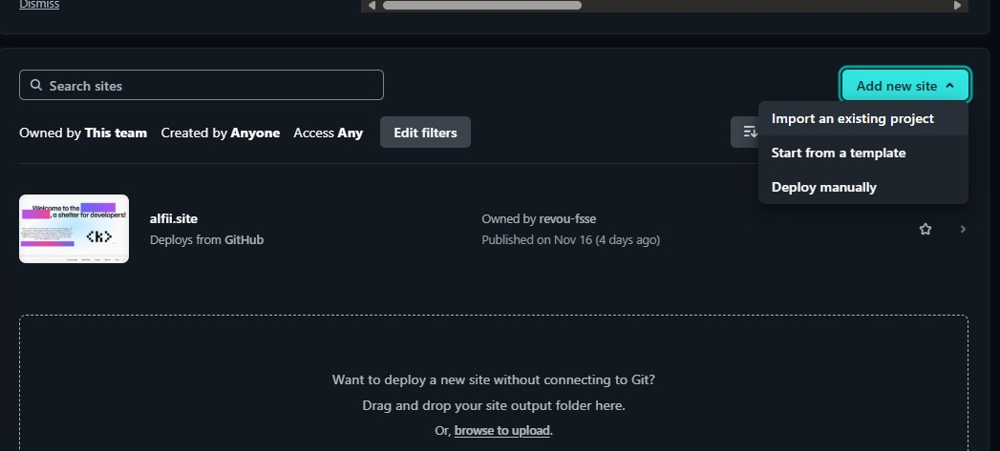

<div align="center">
   
</div>
<br />

<div align="center">
   <a href="https://github.com/alfifrr/milestone-1/actions/workflows/pages/pages-build-deployment">
      
   </a>
</div>

# Gravity Gym - Milestone 1 Project

## Table of Contents

- [Gravity Gym - Milestone 1 Project](#gravity-gym---milestone-1-project)
  - [Table of Contents](#table-of-contents)
  - [About the Project](#about-the-project)
  - [Features](#features)
  - [Development Stages](#development-stages)
    - [1. Initial HTML Structure](#1-initial-html-structure)
    - [2. Adding CSS Styling](#2-adding-css-styling)
    - [3. Enhancing with JavaScript](#3-enhancing-with-javascript)
    - [4. Deployment](#4-deployment)
  - [Setup and Running the Project](#setup-and-running-the-project)
    - [Prerequisites](#prerequisites)
    - [Steps](#steps)
  - [Deployment Guide](#deployment-guide)
    - [Deploy to Custom Domain](#deploy-to-custom-domain)
  - [Dependencies and Credits](#dependencies-and-credits)
    - [Dependencies](#dependencies)
  - [Design Considerations](#design-considerations)

---

## About the Project

Gravity Gym is a modern gym website designed with a mobile-first approach. It is optimized for smooth user interaction with responsive designs and accessibility considerations. The project focuses on clean design, black-and-lime color schemes, and a parallax effect for dynamic visuals.

---

## Features

- **Mobile-first design**: Ensures usability across all devices.
- **Parallax scrolling**: Sticky background images create a smooth, immersive experience.
- **Offset scrolling**: Prevents content overlap with a fixed header.
- **Responsive design**: Fits various screen sizes seamlessly.
- **Black and lime color scheme**: Reflects energy and simplicity.

---

## Development Stages

### 1. Initial HTML Structure

This project started with semantic HTML structure, creating a well-structured document containing:

- Logical sections (`header`, `main`, `footer`) for easier navigation.
- Semantic elements consist of several `section`, `article`, and `nav`.

### 2. Adding CSS Styling

Styling was introduced with a mobile-first approach:

- **Fonts**: Google Fonts `Oswald` and `Roboto Slab`.
- **Theme**: Black background with lime accents for a bold and modern look.
- **Effects**: Parallax scrolling and offset adjustment for headers.

### 3. Enhancing with JavaScript

JavaScript improved interactivity:

- A hamburger menu toggle for mobile navigation.
- Smooth scrolling with a 75px offset to prevent content cutoff.

### 4. Deployment

Deployed the project to a custom domain via Netlify and Niagahoster:

- The Netlify deployment was replaced with a registered custom domain.
- Full steps for setup included below.

---

## Setup and Running the Project

### Prerequisites

- Git installed on your machine.
- A code editor like Visual Studio Code.

### Steps

1. Head to your project directory of your liking, make sure you already installed [Git](https://git-scm.com/), then open up Command Palette or Command Prompt
2. Clone the repository:

   ```bash
   git clone git@github.com:alfifrr/milestone-1.git
   ```

3. Navigate to the project directory:
   ```bash
   cd milestone-1
   ```
4. Open the project in Visual Studio Code and start a live server:
   - Use the [Live Server extension](https://marketplace.visualstudio.com/items?itemName=ritwickdey.LiveServer).
   - Alternatively, open `index.html` directly in your browser.

---

## Deployment Guide

### Deploy to Custom Domain

1. **(if you already purchased a domain and already deployed a Netlify site, go to step 5) Purchase a domain** (e.g., via Niagahoster).
2. **Add the custom domain to Netlify**:
   - In the **Netlify dashboard**, go to **Domain Management** > Add Domain.
   - Enter the purchased domain and use Netlify DNS.
3. **Update Nameservers** at your registrar:
   - Replace your domain's nameservers with those provided by Netlify.
   - Allow 1-24 hours for propagation.
4. Access your site via your custom domain once the changes propagate.
5. If you want to un-link and change your Netlify page to the existing domain, go to the Netlify site dashboard.
   **Add new site > Import an existing project**
   
6. Select your version control platform for deploying purpose, in this case I am using GitHub. If you can't see your repo you want to deploy, choose **Configure the Netlify app on GitHub**
7. Install Netlify to your GitHub account.
8. In the Repository access section, choose **Only select repositories** radio button, then select your repo that you want to deploy.
9. You will be asked for a confirmation about the deployable repository you choose.
10. Define your site name for the Netlify for availability, once it's available, proceed to the next step.
11. Select the active branch for deployment (e.g. `main` branch) then leave everything as is, then deploy your project to the Netlify app.
    
12. Wait for a while, once it's completed, **if you already linked your previous Netlify project page to your custom domain, remove it because your external domain can't handle two Netlify domains at once**. Head to the Netlify's sidebar and then choose **Domain Management > Production Domains > Choose your primary domain from the list and select `Remove domain`**
    
13. Check and add your custom domain from Niagahoster. You don't have to redo the nameservers setup again on the Niagahoster, because you already deployed your Netlify site from your previous project.
14. Wait for several minutes, and your page will be up and running on your existing Niagahoster domain.

---

## Dependencies and Credits

### Dependencies

- **Google Fonts**:
  - [Oswald](https://fonts.google.com/specimen/Oswald)
  - [Roboto Slab](https://fonts.google.com/specimen/Roboto+Slab)
- **Images**:
  - Hero: [The Gigachad, Ernest Khalimov on bioscops.com](https://bioscops.com/ernest-khalimov-height/)
  - Background Image 1: [Victor Freitas on Pexels](https://www.pexels.com/photo/2261479/)
  - Background Image 2: [Rod Bartoletti on WallpaperCat](https://wallpapercat.com)

---

## Design Considerations

1. **Mobile-first approach**: Ensured seamless usability on smaller screens before scaling up.
2. **Color scheme**: Black conveys sophistication, and lime adds energy.
3. **Parallax scrolling**: Sticky background images for dynamic visuals.
4. **Offset scrolling**: Prevents header from cutting content.

---

&copy; 2024 Gravity Gym. All rights reserved.
